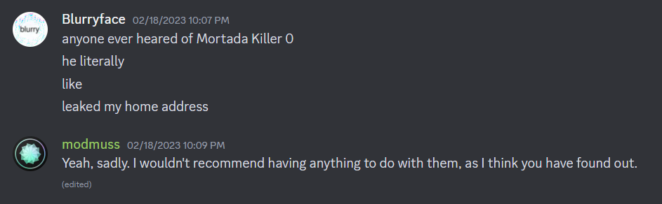

# MortCodesWeb

## Coding Languages
HTML, CSS, JavaScript, SVG, XML, JSON, Java, Bash, Some Rust, and Node.js
## About
So basically I'm a ex-Minecraft JAPPA-like mod artist that decided to code a OS (Because grown ass adults in their 30-40s decided to bully me viciously into quitting the game for not speaking English well) and does a pretty good job at it.

Thank you bullies, now I have a life and a real career unlike you. Hope Java gets you guys anywhere since nobody uses Java except Android app developers and all will you do is write android app bootstraps. Not the app. Me tho. I code the platform.

Good luck with your half ass mods and oily piss-like JAPPA wannabe textures. Advice from me. JAPPA textures are balance of rough and flat, not oily smooth.

This whole Minecraft community has betrayed me and treated me like garbage numerous times that I lost track so I delivered a giant "fuck you" gift to them with Orchid :D

# BEWARE: Blurryface is EMQSA Grupo
Yes. The same dude who faked a long friendship, worried me for entertainment, asked for Orchid user data keys, defended bullying, scammed people, tried to use me as a scapegoat to scam by attaching his scam with Orchid, tricked me into free labour aaand doxxed me when i got COVID-19 and couldn't help him (Mihaisirius moment), tried to lie and make up shit on the spot to justify doxxing me, says the n-word non-hesitently, hides IP grabbers in his own website, and always hides behind "youre homophobic" to excuse his shit.

Never change, Asshole. Never change.
</img>

Update: He also for god knows why searches up and shares CP and actually buys illegal shit from dark web
